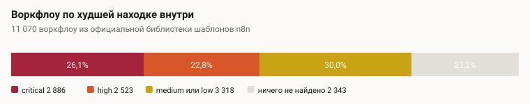
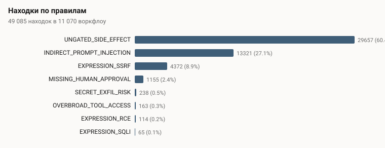
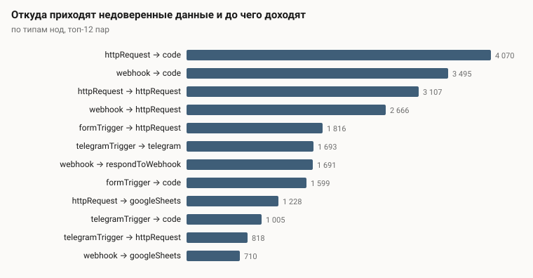

# Что 11 070 публичных воркфлоу n8n делают с недоверенным вводом

Каждое число здесь получено командой `pnpm corpus:study`, которая сканирует закэшированный
корпус и пишет этот файл. Руками не набрано ничего, поэтому текст не может разъехаться с
данными.

**У 26,1% воркфлоу собственной библиотеки шаблонов n8n есть хотя бы один путь, по которому данные извне доходят до действия, которое нельзя отменить, и между ними нет ничего.**

Среди 3 736 воркфлоу, дающих модели инструменты для вызова, таких 64,0%.

## Что сканировалось

| | |
| --- | --- |
| Источник | Официальная библиотека шаблонов n8n, `https://api.n8n.io/api/templates` |
| Библиотека сообщает | 11 127 воркфлоу |
| Идентификаторов отдал поисковый эндпоинт | 11 127 |
| В кэше | 11 070 записей |
| Проанализировано | 11 070 воркфлоу |
| Пропущено | 0 записей без графа внутри |
| Нод | 226 706, медиана 17 на воркфлоу |
| Сканер | n8n-sentinel, 169 классифицированных типов нод, дефолты нод из n8n 2.32.7 |
| Прогон | 2026-08-12 |

Это все идентификаторы, которые перечисляет библиотека. 57 из них (0,5%) отдают 404 — шаблоны, отозванные с тех пор, — так что исследование покрывает 99,5% библиотеки в её нынешнем виде.

Воркфлоу в этой библиотеке публикуют n8n и сообщество как примеры для копирования — и
именно это делает форму результатов интересной: перед нами шаблоны, с которых люди начинают,
а не те, к которым они пришли.

### Почему эта библиотека, а не та, которой пользуются все

Очевидный корпус для такого исследования — [`Zie619/n8n-workflows`](https://github.com/Zie619/n8n-workflows),
за которым тянутся почти все статьи про воркфлоу n8n. **Для анализа графов он непригоден.**
Из его 2061 файла воркфлоу у 694 объект `connections` опустошён целиком, а у 1362 переписан
ключами-UUID, указывающими на несуществующие ноды. Целыми остались четыре. Это проверяется по
`raw.githubusercontent.com`, то есть таково состояние самого репозитория, а не артефакт
клонирования.

У воркфлоу без рёбер нет путей, и сканер, натравленный на этот репозиторий, не нашёл бы почти
ничего и выглядел бы при этом отлично. Это исследование использует библиотеку, которую отдаёт
сам n8n.

## Главное число



| | Воркфлоу | Доля |
| --- | --- | --- |
| Хотя бы одна `critical` | 2 886 | 26,1% |
| Хотя бы одна `high` или хуже | 5 409 | 48,9% |
| Хотя бы одна находка любой полосы | 8 727 | 78,8% |
| Содержат ноду, умеющую вызывать инструменты | 3 736 | 33,7% |

Последняя строка — та, что меняется со временем. Агент это то, что превращает текст в
действие, и у 33,7% этой библиотеки он уже есть.

**Цитировать надо 26,1%, а не 78,8%.** Нижняя полоса составляет 42,6% всех находок и существует, чтобы её отфильтровывали; см. ограничения ниже.

## По правилам



| Правило | Находок | Доля |
| --- | --- | --- |
| `UNGATED_SIDE_EFFECT` | 29 657 | 60,4% |
| `INDIRECT_PROMPT_INJECTION` | 13 321 | 27,1% |
| `EXPRESSION_SSRF` | 4 372 | 8,9% |
| `MISSING_HUMAN_APPROVAL` | 1 155 | 2,4% |
| `SECRET_EXFIL_RISK` | 238 | 0,5% |
| `OVERBROAD_TOOL_ACCESS` | 163 | 0,3% |
| `EXPRESSION_RCE` | 114 | 0,2% |
| `EXPRESSION_SQLI` | 65 | 0,1% |

Всего 49 085 находок: 6 613 `critical`, 10 699 `high`, 10 887 `medium`, 20 886 `low`. 34,5% помечены как `uncertain`: сканер видит путь, но не видит, что он эксплуатируем, и говорит об этом вместо того, чтобы округлить вверх.

`INDIRECT_PROMPT_INJECTION` — это 27,1% находок и флагман этого инструмента: недоверенный ввод доходит до модели, держащей инструменты, а та дотягивается до чего-то необратимого, и человека между ними нет.

## Куда доходят недоверенные данные



| Нода-sink | Эффект | Находок |
| --- | --- | --- |
| `code` | execute-code | 13 451 |
| `httpRequest` | http-egress | 10 754 |
| `googleSheets` | write-database | 3 950 |
| `telegram` | send-message | 2 641 |
| `gmail` | send-message | 2 154 |
| `slack` | send-message | 1 873 |
| `respondToWebhook` | disclose-response | 1 759 |
| `googleDrive` | write-file | 1 118 |
| `httpRequestTool` | http-egress | 905 |
| `postgres` | write-database | 713 |
| `emailSend` | send-message | 656 |
| `dataTable` | write-database | 614 |

Самые частые пары источник → sink, по типам нод:

| Откуда | Куда | Находок |
| --- | --- | --- |
| `httpRequest` | `code` | 4 070 |
| `webhook` | `code` | 3 495 |
| `httpRequest` | `httpRequest` | 3 107 |
| `webhook` | `httpRequest` | 2 666 |
| `formTrigger` | `httpRequest` | 1 816 |
| `telegramTrigger` | `telegram` | 1 693 |
| `webhook` | `respondToWebhook` | 1 691 |
| `formTrigger` | `code` | 1 599 |
| `httpRequest` | `googleSheets` | 1 228 |
| `telegramTrigger` | `code` | 1 005 |
| `telegramTrigger` | `httpRequest` | 818 |
| `webhook` | `googleSheets` | 710 |

И что агентам в этом корпусе на самом деле дают в руки:

| Инструмент, подключённый к агенту | Раз |
| --- | --- |
| `httpRequestTool` | 530 |
| `lc:toolWorkflow` | 513 |
| `lc:agentTool` | 496 |
| `googleSheetsTool` | 487 |
| `googleCalendarTool` | 291 |
| `lc:toolThink` | 269 |
| `gmailTool` | 260 |
| `lc:toolHttpRequest` | 241 |
| `lc:mcpClientTool` | 211 |
| `lc:toolCalculator` | 184 |
| `lc:toolCode` | 124 |
| `lc:vectorStorePinecone` | 106 |

## Как принимается решение о находке

В одном абзаце: парсер превращает документ в граф, чьи рёбра говорят, куда идут данные, — а
это не то же самое, как n8n хранит проводку: связь `ai_tool` записана как инструмент → агент,
а направление, в котором путешествует вставленная инструкция, обратное. Каждая нода
классифицируется по реестру из 169 типов нод с разрешением параметров, которые n8n
не сохраняет, потому что они оставлены по умолчанию. Taint распространяется от каждого
источника; шаг человеческого подтверждения его останавливает, условие — нет. Находка — это
путь от источника до sink с приложенной трассой. Severity стартует от того, сколько стоит
источник, и теряет полосу за каждое препятствие.

Каждое такое суждение принималось осознанно и записано в правилах — они лежат данными в
`packages/core/rules/`, и с ними можно спорить, поменяв одну строку.

## Ограничения методики

Честная часть. Каждое из перечисленного делает числа выше неверными в известную сторону.

**Это достижимость, а не эксплуатируемость.** Сканер показывает, что недоверенные данные
могут дойти до действия. Пропустил бы это на самом деле промпт конкретного воркфлоу, его
схема или код ниже по потоку — на такой вопрос статический анализ не отвечает. Каждое число
здесь — верхняя граница настоящих уязвимостей и нижняя граница путей, которые стоит
пересмотреть.

**Ничего не выполнялось.** Ни один воркфлоу не запускался, ни один живой инстанс не
затрагивался, ни против кого не пробовался эксплойт. Это сознательное ограничение этой фазы, и
поэтому ничто здесь нельзя читать как «эти 2 886 воркфлоу эксплуатируемы».

**Границы вложенных воркфлоу не прослеживаются.** Путь в `executeWorkflow` или в
воркфлоу-инструмент показывается как непрослеженный. Часть таких ведёт к необратимым
действиям и здесь недосчитана; часть не ведёт никуда.

**Неявная раскладка полей невидима.** Нода, настроенная раскладывать входящие поля по
колонкам, читает недоверенный ввод, и в её параметрах нет никакого выражения. Правила,
спрашивающие «читает ли параметр недоверенные данные», отвечают «нет», и это опускает часть
находок на полосу ниже, чем они заслуживают.

**Классифицировано 96,2% экземпляров нод, а не все.** Остаток — длинный хвост нод сообщества, ни одна из которых не является частой сама по себе. Неклассифицированная нода считается пропускающей данные насквозь и никогда — sink, поэтому она может скрыть конец пути, но никогда не выдумает его.

**В реестре зашито суждение.** Является ли нода Code необратимым sink, считать ли смену метки
в Gmail эффектом, защита ли нода `if` — это принятые решения, и
разумный человек мог бы расставить их иначе и получить другие итоги. Правила — это данные в
`packages/core/rules/`; поменять одно и перезапустить занимает минуту.

**Библиотека шаблонов — это не продакшен.** Это примеры, написанные, чтобы их копировали и
дорабатывали, часто с заглушками вместо доступов и без настоящих данных за ними. Числа
описывают форму шаблонов, с которых люди начинают, а не состояние чьего-либо живого инстанса.

## Этика

Только агрегаты. Ни идентификатор шаблона, ни название, ни URL, ни имя ноды из просканированных
воркфлоу не попадают ни в этот отчёт, ни в `data.json`, и ни один эксплойт не был написан или
применён против живого инстанса. Анализ читает опубликованный JSON, который n8n отдаёт кому
угодно; отдельные результаты не публикуются потому, что список названных воркфлоу с дырой — это
список целей, а интересна закономерность, а не экземпляр.

## Как это воспроизвести

```bash
export NODE_EXTRA_CA_CERTS=$(brew --prefix)/etc/ca-certificates/cert.pem   # только для macOS/Homebrew
node scripts/fetch-corpus.mjs --limit 12000     # возобновляемо; ~11 тыс. файлов в .corpus-cache/
pnpm corpus:study                               # пересобирает этот файл и графики
```

Кэш не коммитится: это 11 тыс. документов JSON, принадлежащих их
авторам. `data.json` рядом с этим файлом держит все агрегаты, из которых построен отчёт.
